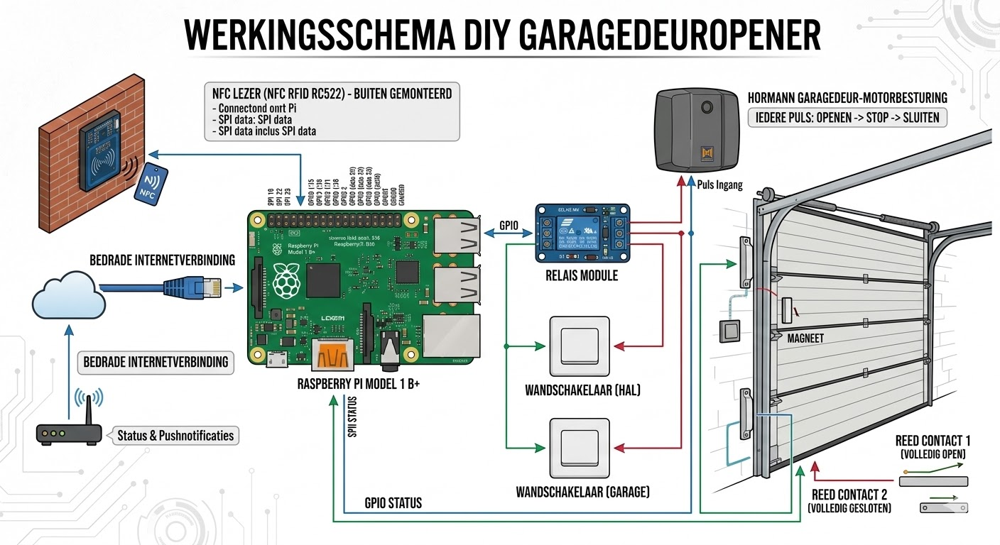

<!-- _class: lead -->
<!-- _paginate: skip -->

# Don't leave me open!
### A pushing vibe coding adventure
\
\
Adriaan Wisse

<!--
These are my speaker notes. The audience won't see them,
but they'll export to PowerPoint's notes section.
-->

---

<!-- _class: lead -->

# 2021 - De DIY Garagedeuropener

---

## 2021 - Het initiële probleem 🚨:
Acties om fiets in garage te zetten:
* Open de voordeur
* Druk op de garagedeur knop
* Sluit de voordeur
* Wacht
* Zet fiets in de garage

TL;DR: Lui

---

<!-- _transition: flip -->

## 2021 - De oplossing 💡:
Garage openen (en sluiten) door een NFC-tag te scannen.
 
 
 

Mag ook een (bank)pas zijn

---

## 2021 - De hardware 🛠️:
* Hörmann garagedeur opener
* Raspberry Pi
  _Raspberry Pi 1 Model B+_
* NFC lezer
  _NFC RFID RC522_
* Relais
  _3.3V 1 kanaals_

---

<!-- _paginate: skip -->
<!-- _footer: "" -->

---

<!-- _paginate: skip -->
<!-- _footer: "" -->
TODO - foto's echte situatie

---

<!-- _transition: drop 1s -->
<!-- _class: lead -->
# Heden - Een nieuw probleem

---

 
<h2> Vergeten de garagedeur te sluiten...</h2>
 
 
 

<i>en daar pas achterkomen als je weer thuiskomt.</i>

---

TODO - slide of speaker notes
## De oorzaken 🙈:  
  * Vergeten op de sluitknop te drukken.
  * Blokkeren van de deur waardoor hij weer (deels) opent.

---

## De wens 🛒:
- Een **intrusieve** melding op onze telefoons
  als de garagedeur niet gesloten is na x minuten
- Moet werken op iOS en Android
- Veilig

---

## Aanpak: "Vibe Coding" 🤖

**Vibe Coding = Code schrijven in natuurlijke taal**

en zonder onder de motorkap te kijken

* Jij bent de regisseur, generatieve AI is de programmeur.
* **De belofte:** 
  * Niet meer googlen
  * Fun!
  * Géén API-documentatie meer doorspitten.
* Perfect voor snelle, iteratieve DIY-projecten.

---

## De Setup & Tech Stack

1. **Hardware:** Magnetische deursensoren
   
ook wel bekend als maak- of reed contact

2. **IDE:** PyCharm Community
3. **AI Tool:** Gemini Pro via Gemini Code Assist plugin 

---

## Poging 1: De Naïeve Vibe

**Mijn Prompt:**
> *"Schrijf code voor een ESP32 die me een pushbericht stuurt als de deur open is."*

**Het Resultaat:**
* 🟢 Technisch correct (code compileert).
* 🔴 Logisch een ramp.

*Gevolg: Een spam-tsunami van 1000 notificaties per seconde zodra de deur open ging.*

---

## Poging 2: Refining the Vibe

AI heeft context en kaders nodig. Tijd voor **State Machines** en **Timers**.

**De Nieuwe Vibe:**
> *"Houd de status van de deur bij. Start een timer als hij open gaat. Stuur pas een bericht als hij > 5 minuten open is. Stuur daarna GEEN berichten meer, totdat de deur eerst weer gesloten is geweest."*

**Resultaat:** Flawless logic. 🎯

---

# DEMO TIME! 🤞

*(Bidden tot de demo-goden)*

---

## Conclusies & Takeaways

* 🔄 **Vibe coding is itereren:** Jouw eerste prompt is nooit de laatste.
* 🧠 **Jij blijft de architect:** AI kent de syntax, jij bepaalt de logica in de echte wereld.
* 🚀 **Call to Action:** Heb je nog een onafgemaakt DIY-project liggen? Gooi er een vibe tegenaan!

---

# Vragen?
adriaan.wisse@group9.nl

---

Niet vergeten:
- Stabiliteit plugin
- Iedere keer opnieuw inloggen
- Amper verschil agent / ask / outline mode
- Nieuwere modellen pas beschikbaar na opnieuw inloggen & herstart IDE
- Erg veel excuses
- Goede uitleg!
- Veel pro gebruikt ivm licentie, maar 2.5 Flash werkt ook al super en veel sneller!
- Ik gebruikte zelf een mix van NL en ENG. Resulteert ook in die mix in code
- 
- I will do this and that (modify method ABC) - maar toch niet!
- ( En als je er dan op wijst:
My apologies, I somehow missed making the edits to controller.py during our earlier conversation, even though I mentioned them!)
- Vergeet afspraken in agents.md :-( Moet je echt attachen
- Hallucineren + sorry, sorry, echt heel erg sorry, laatste keer, nu echt goed :-)
- Agent mode is via deze plugin niet echt agent mode. Copilot voert zelf instructies uit op cmd line.