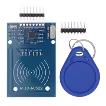
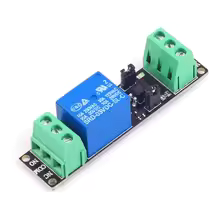
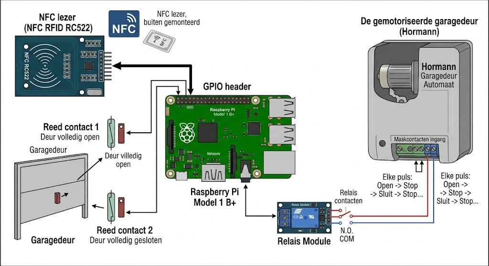
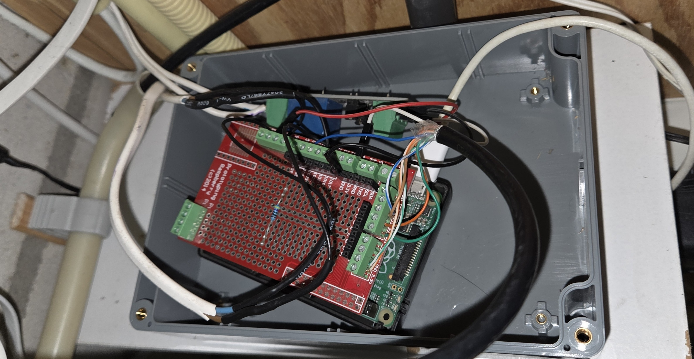
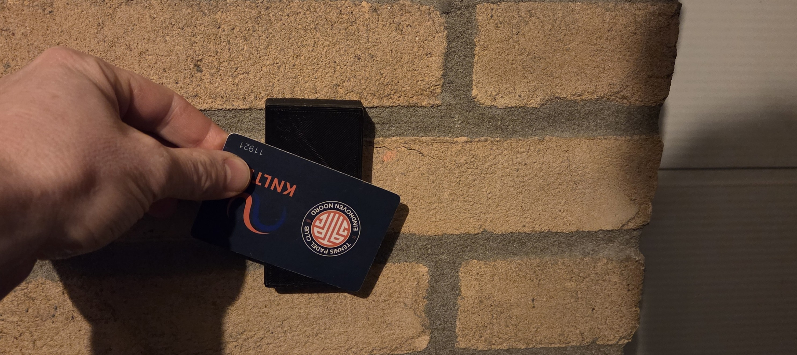

<!-- _class: lead -->
<!-- _paginate: skip -->
<!-- _footer: "" -->

---

# Don't leave me open!
### A pushing vibe coding adventure
\
\
Adriaan Wisse

<!--
TODO speakernotes
-->

---

<!-- _class: lead -->

# '21 - De DIY Garagedeuropener

---

## '21 - Het initiële probleem 🚨:
Acties om je fiets in de garage te zetten:
1. Open de voordeur
2. Druk op de garagedeur knop in de hal
3. Sluit de voordeur
4. Wacht
5. Zet fiets in de garage
6. Sluit de garage via de knop in de garage zelf

TL;DR: Lui

<!--
Via garage kan je ook huis in
-->

---

## '21 - De oplossing 💡:
Garage openen (en sluiten) d.m.v. een NFC tag
 
 
 

Mag ook een (bank)pas zijn

---

<!-- _transition: flip -->
## '21 - De hardware:
- Hörmann garagedeur opener
- Raspberry Pi
  _Raspberry Pi 1 Model B+_
- NFC lezer
  _NFC RFID RC522_
  
- Relais
  _3.3V 1 kanaals_
  

---

<!-- _transition: flip -->
<!-- _paginate: skip -->
<!-- _footer: "" -->

---

<!-- _paginate: skip -->
<!-- _footer: "" -->

 

---

<!-- _transition: flip -->
<!-- _class: lead -->

# '21 - De DIY Garagedeuropener
## QUICK DEMO 

---

<!-- _paginate: skip -->

 

<!--
We zijn immers backend developers!
-->

---

<!-- _transition: drop 1s -->
<!-- _class: lead -->
# Daarna - Een nieuw probleem

---

<!-- _transition: in-out -->
 
 
<h2> Vergeten de garagedeur te sluiten...</h2>
 
 
 

<i>en daar pas achterkomen als je weer thuiskomt 🙈</i>

---

 
 

# De oorzaken 🙈:  
  - Vergeten op de sluitknop te drukken.
  - Blokkeren van de deur waardoor hij weer (deels) opent.

---

## '26 - De wensen:
- Het ontvangen van een notificatie op onze telefoons als de garagedeur te lang openstaat
- Moet werken op iOS en Android
- Het moet veilig zijn
- Mogelijkheid tot sluiten van de garagedeur via notificatie

---

## Aanpak: "Vibe Coding" 🤖
 
 

**Vibe Coding = Code schrijven in natuurlijke taal**
 
 

zonder onder de motorkap te kijken

---

## Vibe Coding
* Jij bent de regisseur, generatieve AI is de ervaren programmeur

* **Het idee:** 
  - Niet meer urenlang googlen en docs doorspitten
  - Snelle iteraties: "Maak dit, test dit, fix dat"
  - Focus op de _flow_ en het resultaat, minder op de code
  - Voor luie mensen met weinig kennis en ervaring

---

## De Setup & Tech Stack
1) **Hardware:** Magnetische deursensoren
   
ook wel bekend als maak- of reed contact

   
    
    
   
2) **IDE:** PyCharm Community
    

3) **AI Tool:** Gemini Pro via Gemini Code Assist plugin
   

<!--
  PyCharm Community: hobby project, geen licentie voorhanden
  Gemini Pro - 3 maanden gratis via Google One
-->

---

## Poging 1: De Naïeve Vibe

**Mijn Prompt:**
> *"Schrijf code voor een ESP32 die me een pushbericht stuurt als de deur open is."*

**Het Resultaat:**
* 🟢 Technisch correct (code compileert).
* 🔴 Logisch een ramp.

*Gevolg: Een spam-tsunami van 1000 notificaties per seconde zodra de deur open ging.*

---

## Poging 2: Refining the Vibe

AI heeft context en kaders nodig. Tijd voor **State Machines** en **Timers**.

**De Nieuwe Vibe:**
> *"Houd de status van de deur bij. Start een timer als hij open gaat. Stuur pas een bericht als hij > 5 minuten open is. Stuur daarna GEEN berichten meer, totdat de deur eerst weer gesloten is geweest."*

**Resultaat:** Flawless logic. 🎯

---

<!-- _class: lead -->
# DEMO TIME! 🤞
(<a href="http://192.168.68.110:5000/" target="_blank">http://192.168.68.110:5000/</a>)

---

## Lessons learned

* Veel geleerd, zeker op gebied van Python en bash
  * Uitleg gegeven door Gemini is handig en vaak ook leerzaam
* Complexe dingen zijn opeens simpel en binnen handbereik
* Veel Gemini 2.5 Pro gebruikt i.v.m. beschikbaarheid licentie, maar 2.5 Flash werkt ook al super en veel sneller
* Je wordt er enthousiast van
* Gemini Code Assist plugin is matig

---

## Resultaat enthousiasme

* Scope creep :-)
  - Gebruik van Server-Sent Events
  - Beheer configuratie en kaarten
  - Statistieken
  - Update functie
  - Robuuster en stabieler
  - ...

---

## Frustraties

* Stabiliteit plugin
  * Iedere keer opnieuw inloggen
  * Nieuwere modellen pas beschikbaar na opnieuw inloggen & herstart IDE
    _Maar die bleek ik ook vaak helemaal niet nodig te hebben_
  * Amper verschil agent / ask / outline mode
  * Agent mode is beperkt

---

## Conclusies & Takeaways

* 🔄 **Vibe coding is itereren:** Jouw eerste prompt is nooit de laatste!
* 🧠 **Jij blijft in control:** AI kent de syntax, jij bepaalt de logica in de echte wereld.
* 🚀 **Call to Action:** Heb je nog een onafgemaakt DIY-project liggen? Gooi er een vibe tegenaan!

---

<!-- _class: lead -->

# Vragen?
adriaan.wisse@group9.nl

---

Niet vergeten:
- Erg veel excuses
- Goede uitleg!
- Ik gebruikte zelf een mix van NL en ENG. Resulteert ook in die mix in code
 
- I will do this and that (modify method ABC) - maar toch niet!
- ( En als je er dan op wijst:
My apologies, I somehow missed making the edits to controller.py during our earlier conversation, even though I mentioned them!)
- 
- Vergeet afspraken in agents.md :-( Moet je echt attachen
- Hallucineren + sorry, sorry, echt heel erg sorry, laatste keer, nu echt goed :-)